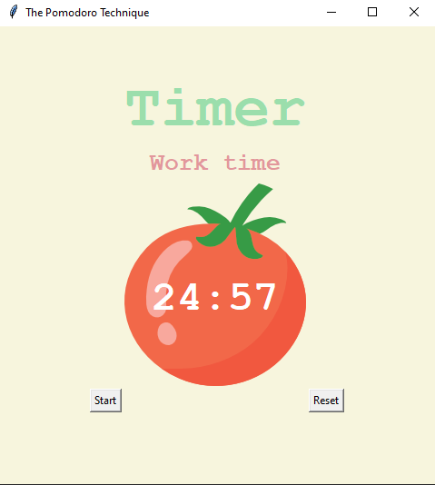

# The pomodoro technique app

> A pomodoro app is time count down for work, 25 minutes, followed by short breaks.

## Table of Contents
* [Technologies Used](#technologies-used)
* [Features](#features)
* [Screenshots](#screenshots)
* [Project Status](#project-status)

## Technologies Used
- Python 3.12

## Features
List the ready features here:
- Timers for work time, short break and long break
- Check mark after a work time
- Reset and start clock functions

## Screenshots

## Project Status
Project is:  _complete_ 
